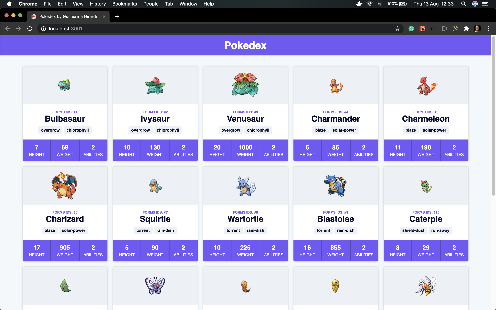

# Pokedex

This is the **Pokedex**, a project that I could learn TypeScript in a proffesional way.

## The project

The project was developed with [**_TypeScript_**](https://www.typescriptlang.org/) with [**_React_**](https://reactjs.org/).
[**_Redux-Saga_**](https://redux-saga.js.org/) was used to handle the state and API calls in [**_PokeAPI_**](https://pokeapi.co/).

**Home**

## Getting started

1.  Prerequisites

- npm

      npm install npm@latest -g

2. Installation

- Clone the repo

      git clone https://github.com/euguilhermegirardi/Pokedex.git

3. Install NPM packages

       npm install

4. Run the application

       npm run start

## Contributing

1.  Fork the project
2.  Create your feature branch (`git checkout -b feature/AmazingFeature`)
3.  Commit your changes (`git commit -m 'Add some AmazingFeature'`)
4.  Push to the branch (`git push origin feature/AmazingFeature`)
5.  Open a pull request

## License

